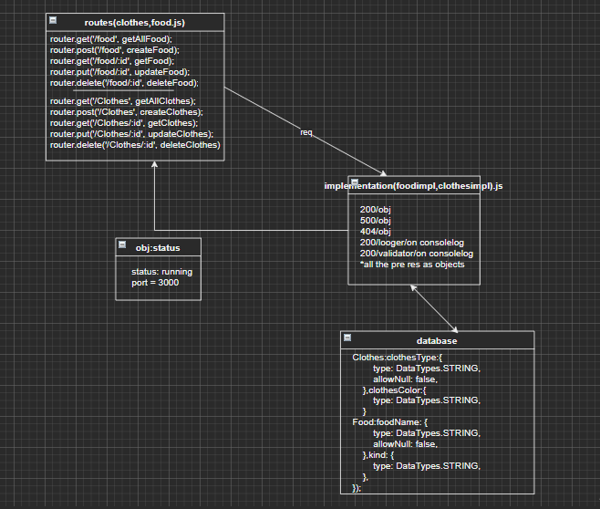

# api-server
LAB - 04  API SERVER

* Author: Maram Abu Murad
* [tests report](https://github.com/Maram-997/api-server/actions)
* [Heroku link]()
* Setup
.env requirements PORT - 3000
* Running the app npm index.js
* Endpoint: /food /food/:id return obj
            /clothes /clothes/:id return obj
Endpoint : '*' returns ERROR 'Page NOT FOUND.'
Endpoint : /badConnection Returns Object { "error": 500, "path": "/badConnection", "message": "Something WENT WRONG Internal Server Error" }
* Tests 
npm test
* UML Diagram
